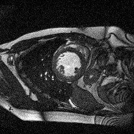
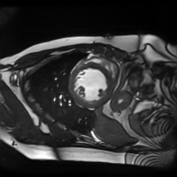
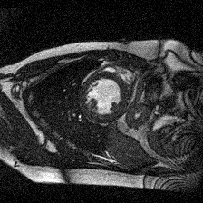
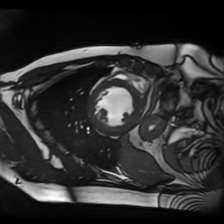
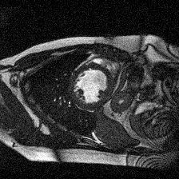
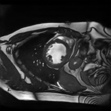

# Deformed2Self: Self-Supervised Denoising for Dynamic Medical Imaging

## Resources

- [paper (arxiv)](https://arxiv.org/pdf/2106.12175.pdf)

## Requirements

- python 3.8
- pytorch 1.4
- pyyaml
- tqdm
- scikit-image

## Run Demo

```
python demo.py
```

## Examples

|noisy|denoised|reference|
|---|---|---|
|| ||
|| ||
|| ||

## Citation

```
@article{xu2021deformed2self,
  title={Deformed2Self: Self-Supervised Denoising for Dynamic Medical Imaging},
  author={Xu, Junshen and Adalsteinsson, Elfar},
  journal={arXiv preprint arXiv:2106.12175},
  year={2021}
}
```

## Contact

For questions, please send an email to junshen@mit.edu